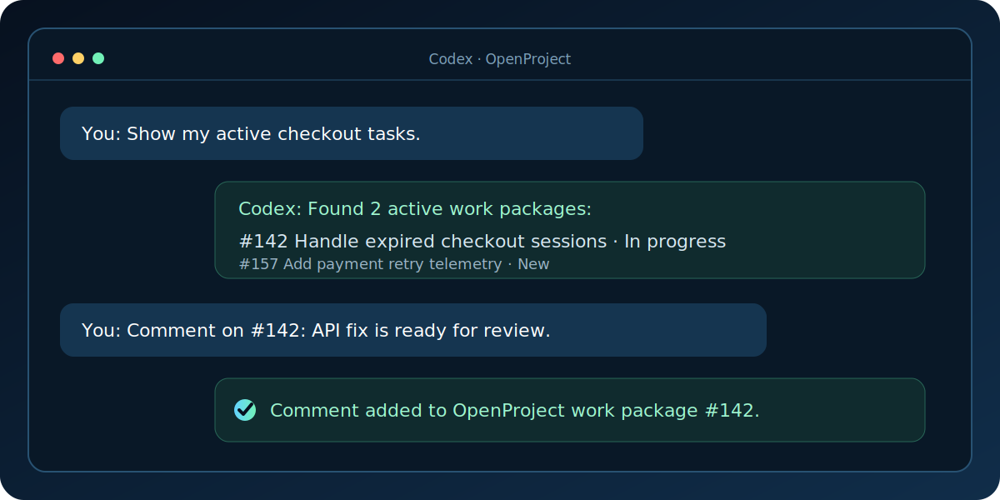

# OpenProject for Codex

<p align="center">
  
</p>

[](https://github.com/alex13slem/openproject-codex-plugin/actions/workflows/ci.yml)
[](https://github.com/alex13slem/openproject-codex-plugin/releases)
[](LICENSE)
[](https://www.openproject.org/docs/api/)
[](https://github.com/alex13slem/openproject-codex-plugin/stargazers)

**Manage OpenProject from Codex — including creating, updating, and commenting
on work packages.** This free, open-source integration uses API v3 and is
designed to work with OpenProject Community and Enterprise editions.

<p align="center">
  
</p>

## Why this project

- **Read and write:** search, create, update, assign, and comment from Codex.
- **Community Edition friendly:** it uses the generally available OpenProject
  API v3 rather than requiring the OpenProject MCP Enterprise add-on.
- **Codex-native workflow:** tools and guidance are packaged together so Codex
  can safely turn natural-language requests into explicit OpenProject actions.
- **Runs locally:** credentials stay in a private file on your machine, and
  OpenProject remains the source of truth for permissions.

OpenProject also provides an official MCP server in Professional plans and
above. As of July 2026, that server exposes read-only tools. This community
project is a good fit when you need write operations, Codex-specific guidance,
or support for Community Edition. See the
[official MCP documentation](https://www.openproject.org/docs/system-admin-guide/integrations/mcp-server/)
for the current capabilities of OpenProject's server.

## What it can do

- Find projects and work packages you can access.
- Read complete work-package details.
- Create tasks with Markdown descriptions.
- Update subjects, descriptions, assignees, priorities, and statuses.
- Add Markdown comments to work packages.
- Guide Codex toward safe, explicit OpenProject write operations.

## Example workflow

```text
You:   Find checkout-related tasks in the Storefront project.
Codex: I found #142 "Handle expired checkout sessions" and
       #157 "Add payment retry telemetry".

You:   Add a comment to #142 saying the API fix is ready for review.
Codex: Added the comment to work package #142.
```

Codex resolves the request through MCP tools, while OpenProject remains the
source of truth for permissions and work-package state.

## Requirements

- [Bun](https://bun.sh/) 1.3 or newer
- Codex CLI with MCP support
- An OpenProject API token with access to the projects you want to manage

The plugin and its local MCP server run natively on macOS, Linux, and Windows.
It uses stable OpenProject API v3 endpoints and does not require an OpenProject
Enterprise add-on. If you use Community Edition, make sure API tokens are
enabled in your instance.

## Quick start

Clone the repository:

```bash
git clone https://github.com/alex13slem/openproject-codex-plugin.git
cd openproject-codex-plugin
```

### macOS and Linux

Create a private environment file:

```bash
mkdir -p ~/.codex
cp .env.example ~/.codex/openproject.env
chmod 600 ~/.codex/openproject.env
```

Set your OpenProject URL and API token in that file:

```dotenv
OPENPROJECT_URL=https://tasks.example.com
OPENPROJECT_API_TOKEN=your-api-token
```

Install the MCP integration:

```bash
./scripts/install.sh
```

### Windows

From PowerShell, create the environment file:

```powershell
$envDir = Join-Path $HOME ".codex"
New-Item -ItemType Directory -Force $envDir
Copy-Item .env.example (Join-Path $envDir "openproject.env")
notepad (Join-Path $envDir "openproject.env")
```

Set `OPENPROJECT_URL` and `OPENPROJECT_API_TOKEN`, save it, then install:

```powershell
.\scripts\install.ps1
```

The installer passes paths as separate arguments, so repository and profile
paths containing spaces work on every supported desktop OS.

### Start using the plugin

Start a new Codex thread, then try prompts such as:

- `Show my active OpenProject tasks.`
- `Find work packages mentioning the checkout flow.`
- `Add a progress comment to work package 123.`

The first two prompts are read-only. Write tools are used only for explicit,
unambiguous requests and return a direct link to the affected work package.

To keep the environment file elsewhere, pass its absolute path during
installation on any desktop OS:

```bash
bun scripts/install.ts --env-file /secure/path/openproject.env
```

```powershell
.\scripts\install.ps1 --env-file C:\secure\openproject.env
```

## Tools

| Tool | Purpose | Access |
| --- | --- | --- |
| `list_projects` | List and filter visible projects | Read |
| `search_work_packages` | Search by subject, project, assignee, due date, and status | Read |
| `get_work_package` | Fetch a complete work package | Read |
| `create_work_package` | Create a work package | Write |
| `update_work_package` | Update selected work-package fields | Write |
| `add_work_package_comment` | Add a Markdown comment | Write |

Write operations use the permissions of the API-token owner. Prefer a token
with only the access you need, never commit it, and keep the environment file
readable only by your user.

## Codex plugin marketplace

The repository includes a plugin manifest and a marketplace definition at
`.agents/plugins/marketplace.json`. Codex installations with plugin marketplace
support can add the repository as a local marketplace. The Bun installer and
its shell wrappers are the portable fallback when only MCP configuration is
available.

## OpenProject's MCP server compared

| Capability | This project | OpenProject MCP server |
| --- | --- | --- |
| Community Edition | Yes | Enterprise add-on |
| Search and read | Yes | Yes |
| Create, update, and comment | Yes | Read-only as of July 2026 |
| Codex workflow guidance | Included | Client-independent |
| Deployment | Local Bun process | Built into OpenProject |

The official server may be preferable for centrally administered, multi-user
OAuth deployments. This project is aimed at individual Codex users who want a
portable integration and write-capable workflows.

## Documentation

- [Architecture and security boundaries](docs/architecture.md)
- [Troubleshooting](docs/troubleshooting.md)
- [Roadmap](ROADMAP.md)
- [Changelog](CHANGELOG.md)
- [Contributing](CONTRIBUTING.md)

## Community

- Ask setup questions and share workflows in
  [GitHub Discussions](https://github.com/alex13slem/openproject-codex-plugin/discussions).
- Report reproducible bugs with the
  [bug template](https://github.com/alex13slem/openproject-codex-plugin/issues/new?template=bug_report.yml).
- Propose focused improvements with the
  [feature template](https://github.com/alex13slem/openproject-codex-plugin/issues/new?template=feature_request.yml).

Please do not include API tokens, private instance URLs, or customer data in
public posts.

## Development

```bash
cd plugins/openproject
bun install --frozen-lockfile
bun run check
```

Generate a local coverage report with:

```bash
bun run test:coverage
```

The API module is covered by tests for request authentication, HAL collection
handling, search filters, update payloads, and error responses. See
[CONTRIBUTING.md](CONTRIBUTING.md) before opening a pull request.

## Project layout

```text
plugins/openproject/
├── .codex-plugin/plugin.json   # Plugin metadata
├── .mcp.json                   # MCP process definition
├── scripts/
│   ├── server.ts               # MCP tools and orchestration
│   └── openproject-api.ts      # Tested API client and payload helpers
├── skills/openproject/         # Codex workflow guidance
└── tests/                      # Bun unit tests
```

Planned work is tracked in the [project roadmap](ROADMAP.md). Contributions and
well-scoped feature proposals are welcome.

## Uninstall

macOS and Linux:

```bash
./scripts/uninstall.sh
```

Windows PowerShell:

```powershell
.\scripts\uninstall.ps1
```

## Project status

This project is community-maintained and is not affiliated with or endorsed by
OpenProject GmbH or OpenAI. OpenProject is a trademark of OpenProject GmbH.

If this integration saves you time, consider
[starring the repository](https://github.com/alex13slem/openproject-codex-plugin)
to help other OpenProject users discover it. Bug reports, tested-version
reports, and focused contributions are equally valuable.

## License

[MIT](LICENSE)
