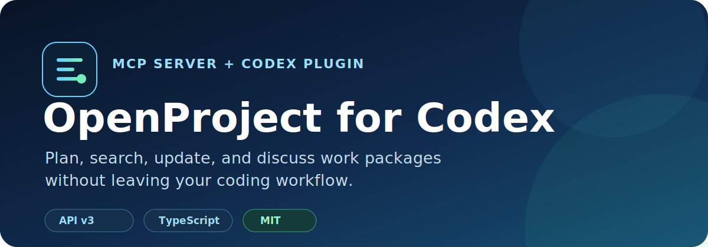

# OpenProject for Codex

<p align="center">
  
</p>

[](https://github.com/alex13slem/openproject-codex-plugin/actions/workflows/ci.yml)
[](https://github.com/alex13slem/openproject-codex-plugin/releases)
[](LICENSE)
[](https://www.openproject.org/docs/api/)
[](https://github.com/alex13slem/openproject-codex-plugin/stargazers)

An unofficial Codex plugin and MCP server for managing OpenProject work without
leaving your coding workflow.

## What it can do

- Find projects and work packages you can access.
- Read complete work-package details.
- Create tasks with Markdown descriptions.
- Update subjects, descriptions, assignees, priorities, and statuses.
- Add Markdown comments to work packages.
- Guide Codex toward safe, explicit OpenProject write operations.

## Example workflow

```text
You:   Find checkout-related tasks in the Storefront project.
Codex: I found #142 "Handle expired checkout sessions" and
       #157 "Add payment retry telemetry".

You:   Add a comment to #142 saying the API fix is ready for review.
Codex: Added the comment to work package #142.
```

Codex resolves the request through MCP tools, while OpenProject remains the
source of truth for permissions and work-package state.

## Requirements

- [Bun](https://bun.sh/) 1.3 or newer
- Codex CLI with MCP support
- An OpenProject API token with access to the projects you want to manage

## Quick start

Clone the repository:

```bash
git clone https://github.com/alex13slem/openproject-codex-plugin.git
cd openproject-codex-plugin
```

Create a private environment file:

```bash
mkdir -p ~/.config/codex
cp .env.example ~/.config/codex/openproject.env
chmod 600 ~/.config/codex/openproject.env
```

Set your OpenProject URL and API token in that file:

```dotenv
OPENPROJECT_URL=https://tasks.example.com
OPENPROJECT_API_TOKEN=your-api-token
```

Install the MCP integration:

```bash
./scripts/install.sh
```

Start a new Codex thread, then try prompts such as:

- `Show my active OpenProject tasks.`
- `Find work packages mentioning the checkout flow.`
- `Add a progress comment to work package 123.`

To keep the environment file elsewhere, pass its absolute path during
installation:

```bash
OPENPROJECT_ENV_FILE=/secure/path/openproject.env ./scripts/install.sh
```

## Tools

| Tool | Purpose | Access |
| --- | --- | --- |
| `list_projects` | List and filter visible projects | Read |
| `search_work_packages` | Search work packages by subject and project | Read |
| `get_work_package` | Fetch a complete work package | Read |
| `create_work_package` | Create a work package | Write |
| `update_work_package` | Update selected work-package fields | Write |
| `add_work_package_comment` | Add a Markdown comment | Write |

Write operations use the permissions of the API-token owner. Prefer a token
with only the access you need, never commit it, and keep the environment file
readable only by your user.

## Codex plugin marketplace

The repository includes a plugin manifest and a marketplace definition at
`.agents/plugins/marketplace.json`. Codex installations with plugin marketplace
support can add the repository as a local marketplace. The installation script
is the portable fallback when only MCP configuration is available.

## Documentation

- [Architecture and security boundaries](docs/architecture.md)
- [Troubleshooting](docs/troubleshooting.md)
- [Roadmap](ROADMAP.md)
- [Changelog](CHANGELOG.md)
- [Contributing](CONTRIBUTING.md)

## Development

```bash
cd plugins/openproject
bun install --frozen-lockfile
bun run check
```

Generate a local coverage report with:

```bash
bun run test:coverage
```

The API module is covered by tests for request authentication, HAL collection
handling, search filters, update payloads, and error responses. See
[CONTRIBUTING.md](CONTRIBUTING.md) before opening a pull request.

## Project layout

```text
plugins/openproject/
├── .codex-plugin/plugin.json   # Plugin metadata
├── .mcp.json                   # MCP process definition
├── scripts/
│   ├── server.ts               # MCP tools and orchestration
│   └── openproject-api.ts      # Tested API client and payload helpers
├── skills/openproject/         # Codex workflow guidance
└── tests/                      # Bun unit tests
```

Planned work is tracked in the [v0.2.0 roadmap](ROADMAP.md). Contributions and
well-scoped feature proposals are welcome.

## Uninstall

```bash
./scripts/uninstall.sh
```

## Project status

This project is community-maintained and is not affiliated with or endorsed by
OpenProject GmbH or OpenAI. OpenProject is a trademark of OpenProject GmbH.

## License

[MIT](LICENSE)
