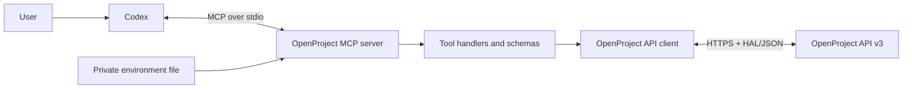

# Architecture

The project is intentionally small: Codex starts one local MCP process, and
that process talks directly to the configured OpenProject API v3 instance.

## Components

- `scripts/server.ts` loads configuration, registers MCP tools, and maps tool
  inputs to OpenProject operations.
- `scripts/openproject-api.ts` owns HTTP authentication, HAL collection
  helpers, filter encoding, update payloads, and API error handling.
- `skills/openproject/SKILL.md` guides Codex toward safe reads and explicit
  writes.
- `.mcp.json` describes how Codex starts the server from the plugin.
- `scripts/install.ts` and `scripts/uninstall.ts` provide the shared installer
  implementation used by the Unix and Windows wrappers.
- `tests/openproject-api.test.ts` exercises request construction, headers,
  errors, HAL helpers, filters, and optimistic-lock update payloads.

## Write path

OpenProject work-package updates use optimistic concurrency:

1. The server reads the current work package.
2. It copies the current `lockVersion` into the update payload.
3. It sends only the fields requested by the user.
4. OpenProject rejects the update if another client changed the work package
   first.

This avoids silently overwriting concurrent changes.

## Security boundaries

- The API token stays in a local environment file and is sent only to the
  configured OpenProject origin.
- The MCP server communicates with Codex over local standard input/output.
- OpenProject remains the authorization authority; the plugin cannot exceed
  the API token owner's permissions.
- Read and write tools are annotated separately, and the bundled skill
  requires an explicit, unambiguous request before a write.
